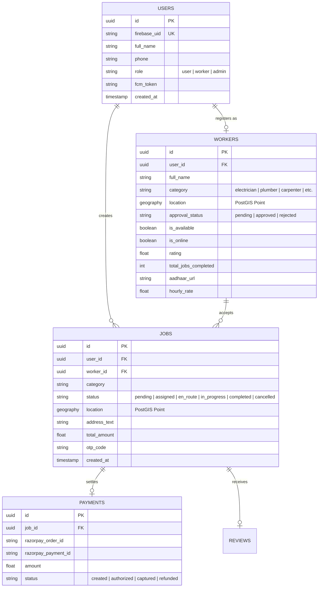

# 🛠️ Jugaad – Hyperlocal On-Demand Skill Marketplace

> **"Connecting every neighborhood in India with verified, trusted, on-demand local trade professionals in minutes."**

[](https://flutter.dev)
[](https://fastapi.tiangolo.com)
[](https://react.dev)
[](https://supabase.com)
[](https://firebase.google.com)
[](LICENSE)

---

## 📌 Table of Contents
1. [🌟 Executive Overview](#-executive-overview)
2. [🏗️ High-Level Architecture](#️-high-level-architecture)
3. [📱 Comprehensive Feature Matrix](#-comprehensive-feature-matrix)
   - [👤 1. User Portal (Customer App)](#1-user-portal-customer-experience)
   - [👷 2. Worker Portal (Service Provider App)](#2-worker-portal-service-provider-experience)
   - [🛡️ 3. Admin Operations Console (Command Dashboard)](#3-admin-operations-console-command-dashboard)
   - [⚡ 4. Backend Gateway & Spatial Dispatch Engine](#4-backend-gateway--spatial-dispatch-engine)
4. [📂 Monorepo Directory Layout](#-monorepo-directory-layout)
5. [🗄️ Database & Spatial Data Modeling](#️-database--spatial-data-modeling)
6. [🔌 API Endpoints & Gateway Reference](#-api-endpoints--gateway-reference)
7. [🚀 Quickstart & Local Setup](#-quickstart--local-setup)
8. [🔒 Security, Roles & Architectural Standards](#-security-roles--architectural-standards)
9. [📚 Extended Documentation](#-extended-documentation)
10. [👥 Contributors & Community](#-contributors--community)

---

## 🌟 Executive Overview

**Jugaad** is a full-stack, enterprise-grade hyperlocal service marketplace built specifically for Tier-2 and Tier-3 Indian cities (launched initially in Mysuru). It bridges the gap between informal blue-collar trade workers (plumbers, electricians, carpenters, painters, AC technicians, appliance mechanics) and household/commercial customers requiring immediate or scheduled service.

### Core Value Propositions:
- **Instant Geolocation Matching**: PostGIS spatial algorithms match users with available, KYC-verified workers within a 5–10 km radius in real-time.
- **Trust & Verification First**: Mandatory Aadhaar verification, skill vetting, and admin review prior to allowing workers on the platform.
- **Unified Dual-Mode Mobile Experience**: Seamless switching between Customer (User) Mode and Provider (Worker) Mode powered by Riverpod state management and GoRouter.
- **Enterprise Operations Console**: Full mission-control dashboard for administrators to monitor active dispatches, audit worker credentials, dynamically adjust surge pricing, and trigger push alerts.

---

## 🏗️ High-Level Architecture

```
                               ┌─────────────────────────────────────────┐
                               │             CLIENT LAYER                │
                               └─────────────────────────────────────────┘
                                   │                                 │
                 ┌─────────────────┴───────────────┐                 │
                 ▼                                 ▼                 ▼
      ┌─────────────────────┐           ┌─────────────────────┐   ┌─────────────────────┐
      │   USER PORTAL       │           │   WORKER PORTAL     │   │   ADMIN CONSOLE     │
      │ (Flutter Mobile/Web)│           │ (Flutter Mobile/Web)│   │  (React 18 + Vite)  │
      └─────────────────────┘           └─────────────────────┘   └─────────────────────┘
                 │                                 │                         │
                 │ Firebase Auth JWT               │ Firebase Auth JWT       │ Supabase Auth +
                 │                                 │                         │ X-Admin-Id Header
                 └─────────────────┬───────────────┘                         │
                                   ▼                                         ▼
                 ┌──────────────────────────────────────────────────────────────────────┐
                 │                FASTAPI API GATEWAY / MONOLITH                        │
                 │    (Python 3.11+ • Async Uvicorn • Redis Rate Limiting & Cache)      │
                 └──────────────────────────────────────────────────────────────────────┘
                                   │                         │
            ┌──────────────────────┴───────┐                 ├──────────────────────────┐
            ▼                              ▼                 ▼                          ▼
 ┌─────────────────────┐        ┌─────────────────────┐ ┌───────────────────┐ ┌─────────────────┐
 │   SUPABASE POSTGRES │        │     REDIS CACHE     │ │ FIREBASE CLOUD    │ │ RAZORPAY API    │
 │ • PostGIS Spatial   │        │ • Geospatial Caches │ │ MESSAGING (FCM)   │ │ • Order Creation│
 │ • RLS Policies      │        │ • Rate Limiting     │ │ • High-Pri Alerts │ │ • Webhook Verify│
 │ • Worker Storage    │        │ • Session States    │ │ • Job Broadcasts  │ │ • UPI / Cards   │
 └─────────────────────┘        └─────────────────────┘ └───────────────────┘ └─────────────────┘
```

---

## 📱 Comprehensive Feature Matrix

### 1. 👤 User Portal (Customer Experience)
*Designed for homeowners and businesses seeking reliable on-demand repairs.*

* **Multi-Category Discovery Hub**:
  - Intuitive catalog across top trade skills: **Electricians**, **Plumbers**, **Carpenters**, **AC & Appliance Technicians**, **House Painters**, **Home Cleaners**, and **Mechanics**.
  - Dynamic visual chips, rich illustrations, and instantaneous search with voice search overlay capabilities.
* **Hyperlocal Worker Matching**:
  - View real-time active, approved, and online workers in the surrounding neighborhood.
  - Direct profile preview with worker avatar/initials, trade badge, star rating, hourly/fixed base fee, and distance (km).
* **3-Step Job Booking Wizard**:
  - **Step 1 (Problem Definition)**: Select service category, sub-skills, issue description, urgency tag (Emergency vs. Standard), and optional voice note/photo attachment.
  - **Step 2 (Location & Scheduling)**: Pin-on-map geolocation picker, saved addresses (Home, Office, Other), and preferred time slot (Immediate Dispatch vs. Scheduled).
  - **Step 3 (Transparent Price Breakdown)**: Estimated base price, distance allowance, dynamic surge/emergency fee fetched from the admin live config, and final booking confirmation.
* **Live Job Tracking & Telemetry**:
  - Real-time job state transitions: `Searching` ➔ `Accepted` ➔ `En Route` ➔ `In Progress` ➔ `Completed`.
  - Worker contact integration (Direct Phone Call and In-App Chat).
* **Payment & Checkout Flow**:
  - Seamless Razorpay payment gateway integration supporting UPI (Google Pay, PhonePe, Paytm), Credit/Debit Cards, Net Banking, and Cash on Delivery (COD).
  - Downloadable receipts, complete payment ledger, and breakdown of taxes & platform fees.
* **Rating & Feedback Ecosystem**:
  - 5-star rating system with customizable review tags (e.g., *Punctual*, *Professional*, *Clean Work*, *Fair Pricing*).
* **User Profile & Management**:
  - Multiple saved address bookmarks, notification preferences, dark/light theme toggling, and fast one-tap switch to Worker Mode.

---

### 2. 👷 Worker Portal (Service Provider Experience)
*Tailored for blue-collar tradespeople to build their local business and receive instant gigs.*

* **Guided 3-Step Onboarding & KYC Wizard**:
  - **Step 1 (Personal & Contact Info)**: Name, phone verification, primary trade selection, profile photo upload.
  - **Step 2 (Verification & Identity)**: Government ID (Aadhaar / Driving License) upload, years of experience, and service radius coverage.
  - **Step 3 (Pricing & Bank Details)**: Base inspection rates, hourly rates, emergency availability, and bank account / UPI VPA for direct payouts.
  - Profile state transitions to `pending` review with an animated submission holding screen.
* **Live Dispatch & Availability Controller**:
  - One-tap prominent **Online / Offline** status switch.
  - Periodic background GPS heartbeat updates keeping spatial indexes fresh.
* **Incoming Job Radar & Sound Alerts**:
  - Full-screen incoming job notification with audible alert chime and countdown timer.
  - Displays customer distance, job category, problem summary, and estimated payout.
  - Instant One-Tap **Accept** or **Pass** controls.
* **Active Job Execution Manager**:
  - Real-time job lifecycle actions:
    1. Tap **"Start Travel"** (`en_route` status notifies user).
    2. Tap **"Arrived at Location"** (GPS verification).
    3. Tap **"Start Work"** (`in_progress` status with live work timer).
    4. Tap **"Complete Work & Generate Invoice"** (Itemized extra parts + labor invoice).
* **Earnings & Financial Analytics**:
  - Comprehensive revenue ledger: Daily, Weekly, and Monthly income cards.
  - Completed jobs count, average customer rating, tips received, and pending payout balances.
  - Bank account linkage with automated settlement logs.
* **Worker Profile & Trade Settings**:
  - Edit skills, portfolio pictures of past jobs, change operational radius, and customize push notification preferences.

---

### 3. 🛡️ Admin Operations Console (Command Dashboard)
*React 18 + Vite desktop dashboard giving operations teams total platform visibility.*

* **Live Platform Telemetry & Analytics**:
  - Real-time KPI metrics: Total Registered Users, Active Online Workers, Ongoing Dispatches, Daily Gross Marketplace Volume (GMV), and Platform Take-Rate Revenue.
  - Auto-refreshing telemetry charts and status indicators.
* **Worker Verification & KYC Audit Center**:
  - Dedicated queue of `pending` worker applications.
  - Side-by-side inspection of uploaded Aadhaar/ID documents, photos, and trade qualifications.
  - **Atomic Backend Approvals/Rejections**: Secure API endpoints (`/v1/workers/{id}/approve` & `/v1/workers/{id}/reject`) that immediately update worker statuses and dispatch automated push notifications to the worker's device.
* **Live Job Dispatch & Geolocation Monitor**:
  - Live table of all active platform jobs with real-time status filtering (`pending`, `assigned`, `in_progress`, `completed`, `cancelled`).
  - Ability to inspect job coordinates, assigned worker, customer details, and payment statuses.
* **Dynamic Platform Configuration Hub**:
  - Real-time modification of operational parameters without restarting backend services:
    - **Emergency Dispatch Radius** (km)
    - **Surge Pricing Multipliers & Fees** (₹)
    - **Platform Commission Fee (%)**
    - **Maximum Worker Dispatch Fallback Radius**
* **Operations Simulator & Communication Logs**:
  - Built-in test harnesses for SMS/WhatsApp/FCM simulated alerts and gateway diagnostics.

---

### 4. ⚡ Backend Gateway & Spatial Dispatch Engine
*High-performance FastAPI gateway engineered for low latency and transactional safety.*

* **PostGIS Spatial Search Engine**:
  - Radius-based proximity lookup (`ST_DWithin` / `ST_DistanceSphere`) prioritizing verified, top-rated, available workers within the customer's vicinity.
  - Dynamic two-stage auto-expansion (e.g., searches within 5 km, automatically broadens to 10 km if worker density is low).
* **Role-Based Security & Middleware**:
  - Dual authentication handling: Firebase JWT decoding for mobile clients and Supabase Admin claims with `X-Admin-Id` validation for operations routes.
  - Rate limiting via Redis / Upstash Redis (clamped to prevent brute force and API scraping).
* **Push Notification Service (FCM)**:
  - Automated high-priority alerts for: *Job Requests*, *Worker Arrival*, *Job Completion*, *Payment Confirmation*, and *KYC Approval/Rejection*.
* **Payment Webhook Orchestration**:
  - Razorpay cryptographic signature verification guaranteeing tamper-proof transaction settlement.

---

## 📂 Monorepo Directory Layout

```
jugaad-app/
├── apps/
│   ├── admin/                      # 🛡️ React 18 + Vite Operations Dashboard
│   │   ├── src/
│   │   │   ├── JugaadOpsDashboard.jsx  # Primary admin console & KYC validation UI
│   │   │   ├── supabaseClient.js       # Supabase Cloud client initialization
│   │   │   └── App.jsx
│   │   ├── package.json
│   │   └── vite.config.js
│   │
│   ├── backend/                    # ⚡ FastAPI API Gateway & Microservices
│   │   ├── main.py                     # App entry point & platform config routes
│   │   ├── routers/                    # REST route controllers
│   │   │   ├── admin.py                # Admin metrics & management routes
│   │   │   ├── auth.py                 # Token verification & user sync
│   │   │   ├── jobs.py                 # Job lifecycle, dispatch & state machine
│   │   │   ├── payments.py             # Razorpay order generation & webhooks
│   │   │   ├── users.py                # Customer profile & address endpoints
│   │   │   └── workers.py              # Worker KYC approval & spatial search
│   │   ├── services/                   # Business logic managers
│   │   │   ├── fcm_service.py          # Firebase push notification dispatcher
│   │   │   ├── payment_service.py      # Razorpay payment operations
│   │   │   └── review_service.py       # Worker rating aggregation
│   │   ├── shared/                     # Global middleware & database pool
│   │   │   ├── auth.py                 # Firebase/Supabase token decoders
│   │   │   └── database.py             # Async database client
│   │   ├── supabase/                   # DDL migrations & PostGIS RPC scripts
│   │   └── requirements.txt
│   │
│   └── mobile/                     # 📱 Flutter Client Application (iOS/Android/Web)
│       ├── lib/
│       │   ├── main.dart               # App entry & async service bootloader
│       │   ├── app.dart                # Riverpod & GoRouter bridge configuration
│       │   ├── app_router.dart         # Path declarations & guard definitions
│       │   ├── core/                   # State providers, network & theme tokens
│       │   │   ├── providers/          # Riverpod Auth & Mode providers
│       │   │   └── config/             # Supabase & backend configuration
│       │   ├── features/               # Domain feature modules
│       │   │   ├── auth/               # Splash, login, OTP & role selection
│       │   │   ├── user/               # Customer portal: Home, Job Wizard, Tracking
│       │   │   ├── worker/             # Worker portal: Radar, Active Job, Earnings
│       │   │   └── shared/             # Reusable UI cards, buttons, badges
│       │   └── shared/widgets/         # Responsive wrappers & theme widgets
│       └── pubspec.yaml
│
├── docs/
│   └── brain.md                    # 🧠 Project Brain: Architecture & decisions index
├── infrastructure/
│   └── docker/
│       └── docker-compose.yml       # Local container orchestration
└── scripts/
    ├── start_local.ps1             # Windows local development runner
    └── start_local.sh              # Unix/macOS local development runner
```

---

## 🗄️ Database & Spatial Data Modeling

The platform uses **Supabase Cloud (PostgreSQL)** with the **PostGIS** spatial extension:



---

## 🔌 API Endpoints & Gateway Reference

| Method | Endpoint | Description | Auth Required |
| :--- | :--- | :--- | :--- |
| `GET` | `/v1/workers/nearby` | Spatial radius query for available trade workers | Yes (User/Worker) |
| `POST` | `/v1/workers/{id}/approve` | Atomically approve worker KYC & trigger FCM alert | Yes (Admin) |
| `POST` | `/v1/workers/{id}/reject` | Reject worker KYC & trigger FCM alert | Yes (Admin) |
| `POST` | `/v1/jobs/create` | Submit new service booking with coordinates | Yes (User) |
| `GET` | `/v1/jobs/active` | Stream ongoing active jobs for user/worker | Yes (User/Worker) |
| `POST` | `/v1/jobs/{id}/status` | Update job state (`en_route`, `in_progress`, etc.) | Yes (Worker) |
| `POST` | `/v1/payments/create-order`| Generate Razorpay order for job settlement | Yes (User) |
| `POST` | `/v1/payments/webhook` | Webhook verification for completed payments | Razorpay Sig |
| `GET` | `/v1/platform/config` | Fetch active surge fees & dispatch parameters | Public |
| `PUT` | `/v1/platform/config` | Update platform config parameters live | Yes (Admin) |

---

## 🚀 Quickstart & Local Setup

### Prerequisites
- [Flutter SDK (3.24+)](https://flutter.dev/docs/get-started/install)
- [Node.js (18+ or 20+)](https://nodejs.org)
- [Python (3.11+)](https://www.python.org/downloads/)
- [Git](https://git-scm.com/)

---

### 1. One-Click Local Launch
From the root directory:

**Windows PowerShell**:
```powershell
.\scripts\start_local.ps1
```

**Linux / macOS**:
```bash
chmod +x ./scripts/start_local.sh
./scripts/start_local.sh
```

---

### 2. Manual Component Setup

#### Backend (FastAPI Gateway):
```bash
cd apps/backend
python -m venv .venv
# On Windows:
.venv\Scripts\activate
# On Linux/macOS:
source .venv/bin/activate

pip install -r requirements.txt
uvicorn main:app --reload --host 0.0.0.0 --port 8000
```

#### Admin Dashboard (React + Vite):
```bash
cd apps/admin
npm install
npm run dev
# Dashboard available at http://localhost:5173
```

#### Mobile Client (Flutter):
```bash
cd apps/mobile
flutter pub get
# Run on Chrome for Web testing
flutter run -d chrome
# Run on connected Android / iOS device
flutter run
```

---

## 🔒 Security, Roles & Architectural Standards

- **Zero Client-Side Verification Writes**: Worker verification flags (`approval_status`, `id_verified`) can only be modified through authenticated backend endpoints that validate admin roles.
- **Synchronous Route Guarding**: GoRouter `redirect()` guards in Flutter evaluate synchronously against Riverpod provider caches, preventing route bouncing and redirect loops.
- **Private ID Storage**: Aadhaar and government identification images are stored in Supabase private storage buckets protected with strict Row-Level Security (RLS) policies accessible exclusively by verified admin accounts.
- **Rate-Limiting & SQL Injection Defense**: All API inputs utilize Pydantic schemas and parameterized database bindings, with Redis-enforced rate clamps on public search endpoints.

---

## 📚 Extended Documentation

For in-depth guides, diagrams, and operational procedures:
- 📖 [Contributing Guidelines (CONTRIBUTING.md)](CONTRIBUTING.md)
- 🏗️ [System Architecture & Sequence Flows (docs/ARCHITECTURE.md)](docs/ARCHITECTURE.md)
- 🔌 [REST API Reference & Endpoints (docs/API_REFERENCE.md)](docs/API_REFERENCE.md)
- 🗄️ [Database Schema & PostGIS Functions (docs/DATABASE_SCHEMA.md)](docs/DATABASE_SCHEMA.md)
- 🔒 [Security Safeguards & Policies (docs/SECURITY.md)](docs/SECURITY.md)
- 📜 [Release History & Milestones (CHANGELOG.md)](CHANGELOG.md)

---

## 👥 Contributors & Community

We are proud of all the contributors powering the Jugaad ecosystem:

<a href="https://github.com/KUSHALMN/Jugaad/graphs/contributors">
  
</a>

---

## 📄 License

This project is licensed under the MIT License - see the [LICENSE](LICENSE) file for details.

Developed with ❤️ for empowering skilled workers and simplifying local services.

