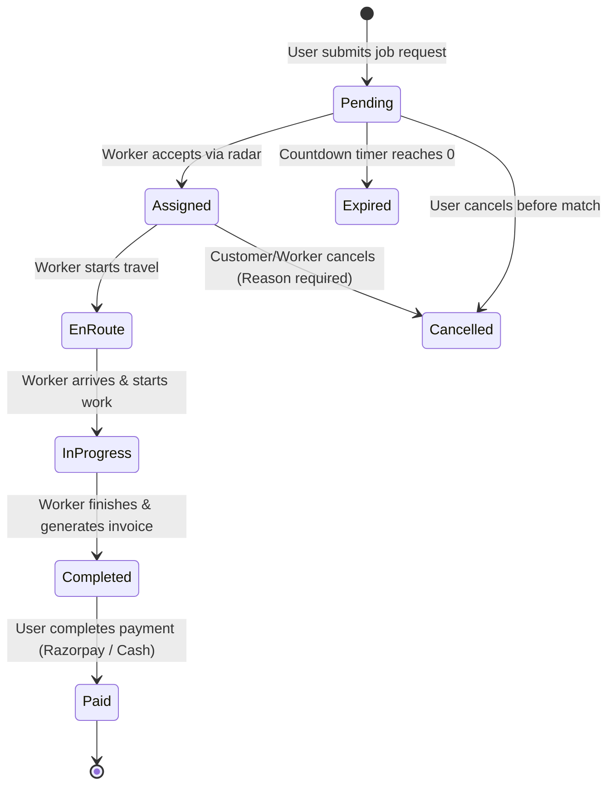
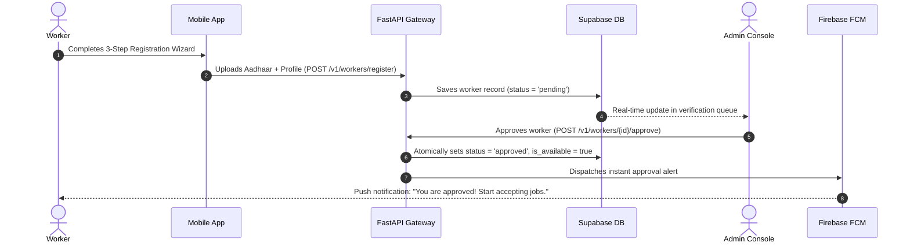

# 🏛️ Jugaad System Architecture & Flow

This document details the architectural blueprints, communication protocols, and state machine lifecycles powering the Jugaad ecosystem.

---

## 1. System Components

```
┌─────────────────┐       ┌─────────────────┐       ┌─────────────────┐
│   User Mobile   │       │  Worker Mobile  │       │  Admin Console  │
│ (Flutter Client)│       │ (Flutter Client)│       │(React 18 + Vite)│
└────────┬────────┘       └────────┬────────┘       └────────┬────────┘
         │                         │                         │
         ▼                         ▼                         ▼
┌─────────────────────────────────────────────────────────────────────┐
│                       FastAPI Gateway Layer                         │
│   • Request Authentication (Firebase/Supabase)                      │
│   • Redis Rate Limiting & Spatial Caching                           │
│   • Dynamic Config Injection                                        │
└──────────────────────────────────┬──────────────────────────────────┘
                                   │
                ┌──────────────────┼──────────────────┐
                ▼                  ▼                  ▼
     ┌────────────────────┐ ┌─────────────┐ ┌────────────────────┐
     │ Supabase Database  │ │ Redis Store │ │ External Services  │
     │ • PostgreSQL       │ │ • Location  │ │ • Firebase FCM     │
     │ • PostGIS Spatial  │ │ • Rate caps │ │ • Razorpay Gateway │
     │ • Row Level Sec.   │ └─────────────┘ └────────────────────┘
     └────────────────────┘
```

---

## 2. Job Lifecycle State Machine



---

## 3. Worker KYC Verification Flow


